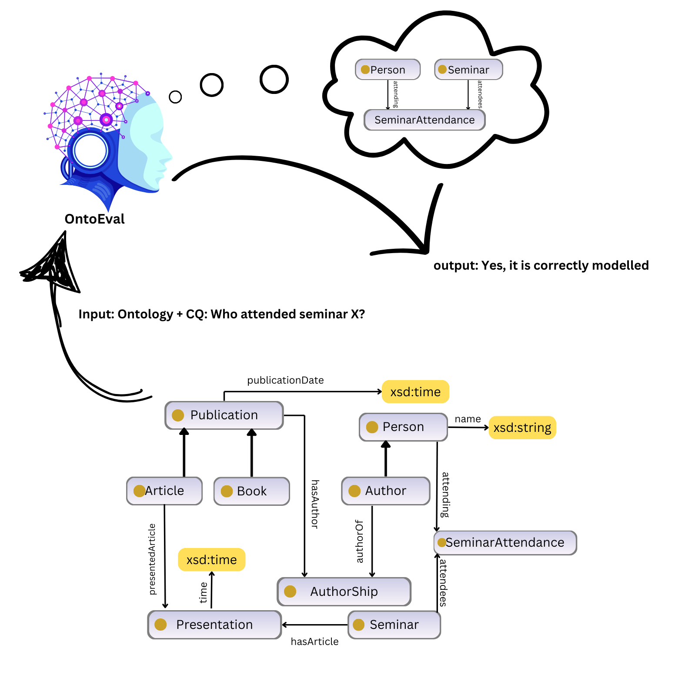

# OntoEval
This repository contains our ontology evaluation prototype. The evaluation method is CQ verification. CQ verification, introduced by Blomqvist et al., is a method for verifying the quality and correctness of ontologies using Competency Questions (CQs). Competency Questions are natural language questions that an ontology should be able to answer if it correctly represent the intended domain knowledge.

 
